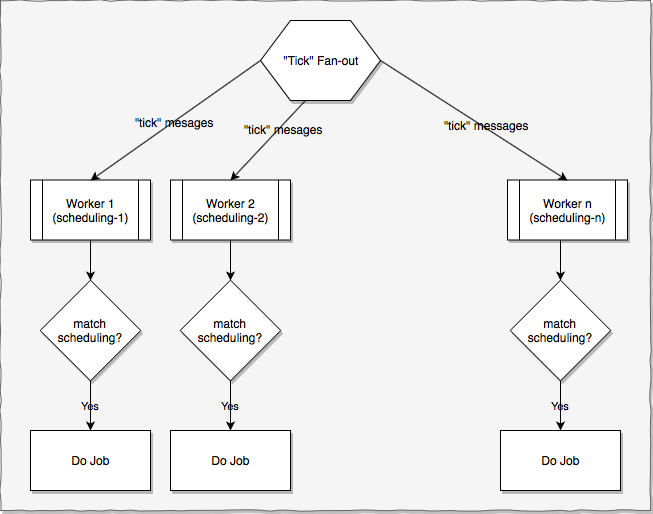
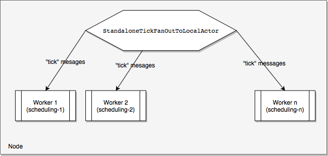
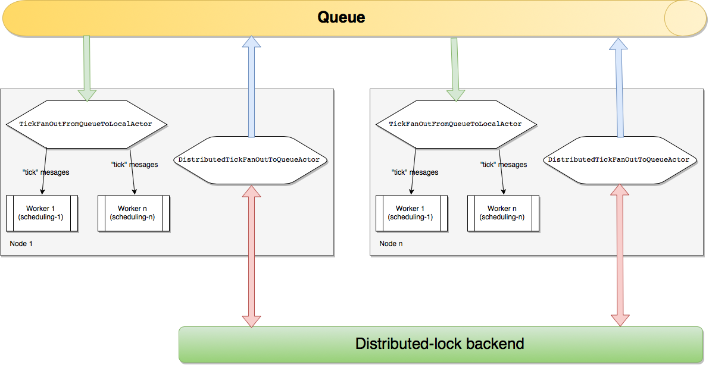

# ddth-akka: Scheduling

Scheduling jobs with [Akka](https://akka.io).

Artifact: `com.github.ddth:ddth-akka-core:${ddth-akka-version}`.

### Introduction

This library helps to schedule jobs to run at designated time.
Scheduled time is expressed in cron-like format (see below).

### High-level Design

- Every "tick" (currently `1 tick = 1 second`), the `tick fan-out` routine broadcasts a `tick message` to all workers.
- The `tick message` is the mechanism to "wake up" workers. The worker then checks if current time (or `tick message`'s timestamp) matches its scheduling.
  - If matched, the worker should do its designated job.
  - If not matched, the worker should simply ignore the `tick message`.

**Implementationn details:**

- `tick fan-out` routine is simply an actor that broadcasts `tick message` every tick.
There are several ready-to-use `tick fan-out` implementations that can be used:
  - `StandaloneTickFanOutToLocalActor`: `tick fan-out` actor that broadcasts `tick messages` to local subscribers. This implementation is used in single-node mode.
  - `DistributedTickFanOutToQueueActor`: `tick fan-out` actor that send `tick message`s to a queue (using [ddth-queue](https://github.com/DDTH/ddth-queue/));
    `TickFanOutFromQueueToLocalActor`: `tick fan-out` actor that takes `tick message`s from a queue and broadcasts to local subscribers.
    These two actors are used in multi-node mode.
- `tick message` is an object of class `com.github.ddth.akka.scheduling.TickMessage`
- Worker is an actor that subscribe to channel `TickMessage.class` to receive `tick message`s. For convenience, worker implementations can extend the built-in `BaseWorker` class.
- There is a built-in class `CronFormat` to help with matching a timestamp against worker's scheduling.

### Single-node mode vs muti-node mode

**Single-node mode**

In single-node mode, the `tick fan-out` routine broadcasts `tick message`s to local workers. 
`StandaloneTickFanOutToLocalActor` is a ready-to-use `tick fan-out` implementation for single-node mode.

**Multi-node mode**

### Implementation Flow for Developers
