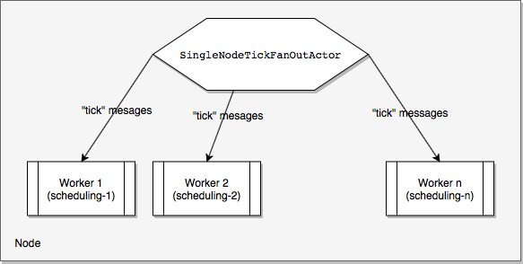
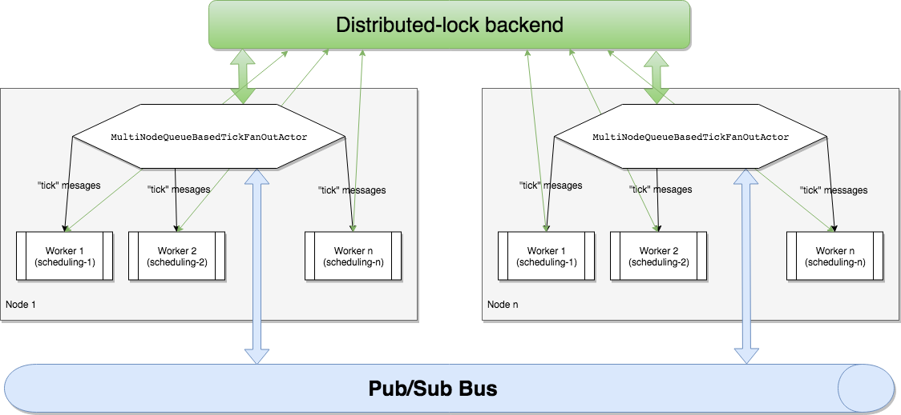

# ddth-akka: Scheduling

Scheduling jobs with [Akka](https://akka.io).

Artifact: `com.github.ddth:ddth-akka-core:${ddth-akka-version}`.

### Introduction

This library helps to schedule jobs to run at designated time.
Scheduled time is expressed in cron-like format (see below).

### High-level Design

- Every "tick" (currently `1 tick = 1 second`), the `tick fan-out` routine broadcasts a `tick message` to all workers.
- The `tick message` is the mechanism to "wake up" workers. The worker then checks if current time (or `tick message`'s timestamp) matches its scheduling.
  - If matched, the worker should do its designated job.
  - If not matched, the worker should simply ignore the `tick message`.

**Implementationn details:**

- `tick fan-out` routine is simply an actor that broadcasts `tick message` every tick.
There are several ready-to-use `tick fan-out` implementations that can be used:
  - `SingleNodeTickFanOutActor`: `tick fan-out` actor that broadcasts `tick messages` to local subscribers. This implementation is used in single-node mode.
  - `MultiNodePubSubBasedTickFanOutActor`: `tick fan-out` actor that broadcasts `tick messages` to workers  in multi-node mode.
- `tick message` is an object of class `TickMessage`
- Worker is an actor that subscribe to channel `TickMessage.class` to receive `tick messages`. For convenience, worker implementations can extend the built-in `BaseWorker` class.
- There is a built-in class `CronFormat` to help with matching a timestamp against worker's scheduling.

### Single-node mode vs muti-node mode

**Single-node mode**

In single-node mode, the `tick fan-out` routine broadcasts `tick messages` to local workers. 
`SingleNodeTickFanOutActor` is a ready-to-use `tick fan-out` implementation for single-node mode.

**Multi-node mode**

In multi-node mode, there are more than 1 node to host workers.
`tick message` broadcasting is broken into 2 phases:
- Firstly, `tick fan-out` routine generates the `tick message` and publishes to a pub/sub channel.
 At one give time ony only one node is allowed to generate `tick messages`.
- Secondly, `tick fan-out` instances on all nodes consume the `tick message` and broadcasts it to local workers.

Since `tick message`s are consumed and broad-casted to all workers on all nodes, 
to ensure consistency and load-balance work amongst worker instances,
Workers must coordinate with each other.
There are 3 worker coordination policies (defined in `WorkerCoordinationPolicy`):

- `TAKE_ALL_TASKS`: worker instance takes all tasks. Multiple tasks can be executed simultaneously on same or different nodes.
- `LOCAL_SINGLETON`: on one node, worker can take one task as a time.But workers one two or more nodes can execute tasks simultaneously.
- `GLOBAL_SINGLETON`: once worker takes a task, all of its instances on all nodes are marked "busy" and can not take any more task until free.

Two external components are needed in multi-node mode:

- [Distributed-lock backend](https://github.com/DDTH/ddth-dlock/): to assist workers/nodes coordination.
- [Pub/Sub backend](https://github.com/DDTH/ddth-queue/blob/master/PUBSUB.md): to publish and consume messages.

### Implementation Flow for Developers

1. Create `ActorSystem`: create and initialize an `ActorSystem`. Helper methods in class `AkkaUtils` can help. See [AkkaUtils](AkkaUtils.md).
2. Create and initialize a `tick fan-out`. You can use ready-to-use implementations `SingleNodeTickFanOutActor` for single-node mode, or `MultiNodePubSubBasedTickFanOutActor` for multi-node mode.
3. Create and initialize workers: a worker is simple an actor that subscribes to `TickMessage.class` channel. For convenience, you can implement your worker by extending `BaseWorker` class.
4. Your worker now should awake and do job when time matches its scheduling.
5. Stop/Terminate the `ActorSystem` when done.
